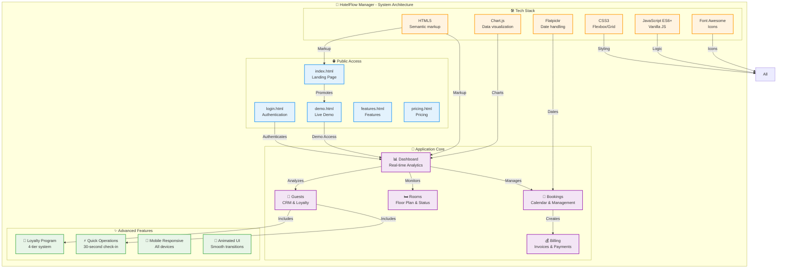
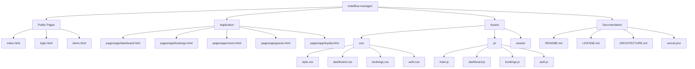
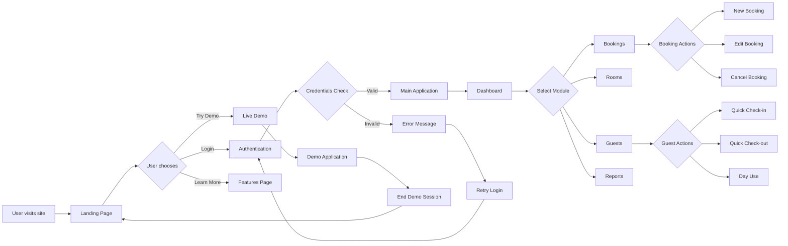
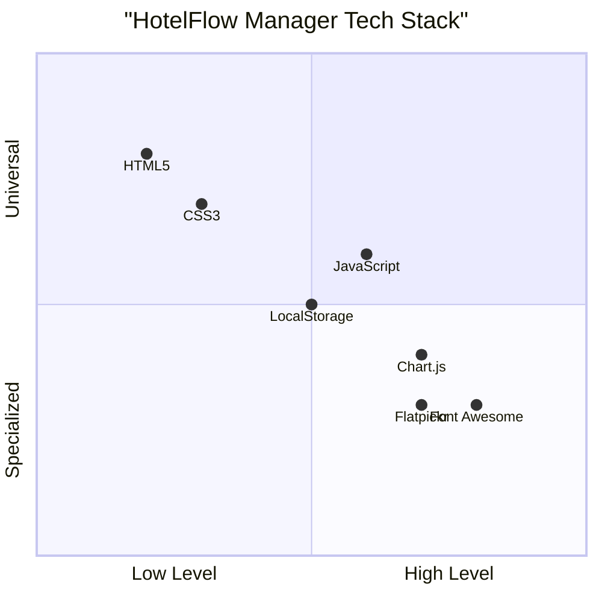
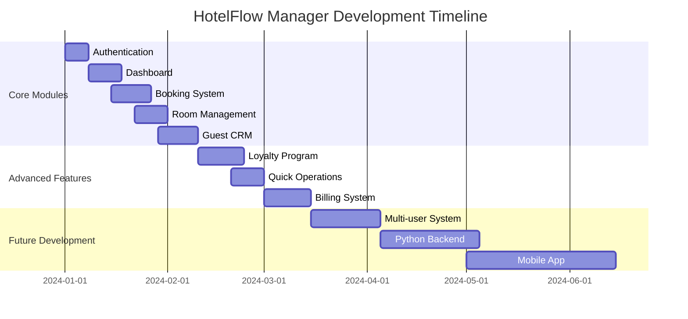

🏨 HotelFlow Manager - Architecture Diagram

## Project Structure Overview

## File Structure

## User Flow

## Technology Stack

## Development Progress

## Legend

- 🟦 **Blue**: Public pages (accessible to all)

- 🟪 **Purple**: Protected application (requires login)

- 🟩 **Green**: Assets and resources

- 🟧 **Orange**: Configuration and documentation

---

*Diagrams created with Mermaid.js - Automatically rendered by GitHub*
